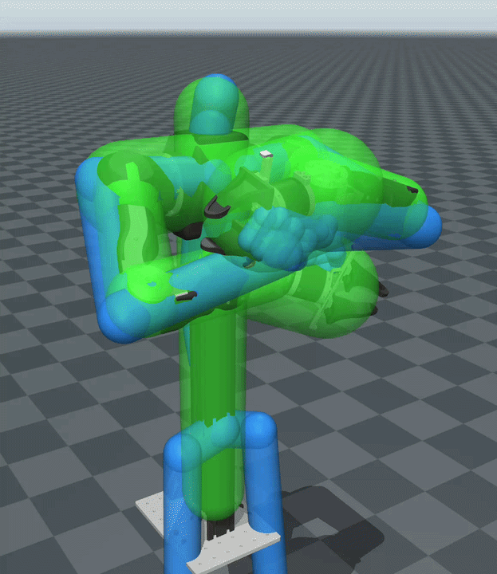

# OpenArm teleoperation



Bimanual OpenArm v1 teleoperation in MuJoCo, using the licensed `geo_kin` Rust
solver and shared input processing from [XRT_devices](https://github.com/Euler-Rodrigues-Lab/XRT_devices).
Replay the same human recordings shipped with G1 and RBY1, or use XR and MediaPipe input.

This repository contains the application, simulation controller, exact v1 model
and meshes, model specification, and sample motion. The analytic solver is supplied
separately as a licensed binary wheel. No robot hardware driver is included.

## Install

Python 3.10 or later and [uv](https://docs.astral.sh/uv/) are required.

```bash
git clone --recurse-submodules https://github.com/Euler-Rodrigues-Lab/openarm_teleop.git
cd openarm_teleop
uv sync --extra test
```

For an existing checkout, initialize its pinned dependencies with
`git submodule update --init --recursive`. Both `external/XRT_devices` and
`external/geo_kin_core` are Git submodules; their code is reused directly.

To use the licensed OpenArm solver, register the supplied wheel and license
once per user, then link the central build into this checkout:

```bash
uv run geo-kin-provision register \
  --product openarm \
  --wheel /path/to/geo_kin-OPENARM.whl \
  --license /path/to/openarm_license.toml \
  --name my-openarm-license \
  --activate
uv run geo-kin-provision install
```

Replace the wheel and license placeholders with the supplied files. The wheel
and license must include the `openarm` feature; G1-only or RBY1-only wheels
cannot run OpenArm. The private binary is stored once outside the repository and
remains linked across normal `uv sync` and `uv run` operations. Confirm the
selected build with:

```bash
.venv/bin/python -c "import geo_kin; print(geo_kin.__file__); geo_kin.RetargetSession(robot='openarm')"
```

The path should be under the shared `geo-kin/installs/openarm` directory. License
activation is user-wide; switching to another robot's license can require
`geo-kin-provision activate my-openarm-license` before returning to OpenArm.
An explicit `GEO_KIN_LICENSE` environment variable takes precedence.

## Offline replay

Launch the bundled RBY1 `ipman_roll` recording on OpenArm:

```bash
.venv/bin/python -m openarm_teleop.demos.replay_offline
```

Choose G1's `picking_up_mustard` recording:

```bash
.venv/bin/python -m openarm_teleop.demos.replay_offline --sample picking_up_mustard
```

| Sample | Original demo | Frames | Capture rate |
| --- | --- | ---: | ---: |
| `ipman_roll` (default) | RBY1 | 600 | 60 Hz |
| `picking_up_mustard` | G1 | 843 | 60 Hz |

These are byte-for-byte copies of the robot packages' sample NPZ files. The
human targets are retargeted to OpenArm; recorded G1/RBY1 joint angles are not
replayed. Both files ship in the package, so no headset, camera, or additional
recording download is needed.

Replay and live simulation default to **kinematic mode**: each solved goal is
applied directly to the robot pose, without actuator dynamics. Add `--dynamic`
to use the position-actuator simulation. Both MuJoCo side panels start hidden.

The viewer uses a bright scene with key/fill lights, a light floor, and a
blue human-skeleton overlay. The overlay uses the same mocap-to-world alignment
as the solver and the robot's mocap base. When safety filtering is enabled,
green translucent capsules show the Rust filter's actual post-XPBD geometry:
torso, shoulder bridge, upper arms, forearms, and hands. They use OpenArm's
own filter radii and the robot's shoulder-centered frame, not the human overlay
radii or a different robot's collision preset. `--no-safety-filter` also hides
these capsules. Use `--no-human-overlay` (also
`--no_human_overlay`) to hide it. The overlay applies to live inputs too.

Replay stops at the end by default. Useful options:

```bash
# Repeat continuously at half speed.
.venv/bin/python -m openarm_teleop.demos.replay_offline --loop --playback-speed 0.5

# Deterministic headless check, without opening a viewer.
.venv/bin/python -m openarm_teleop.demos.replay_offline --headless --max_frames 120

# Supply another frame-stream NPZ or an XRT CSV recording.
.venv/bin/python -m openarm_teleop.demos.replay_offline --frames /path/to/motion.npz
.venv/bin/python -m openarm_teleop.demos.replay_offline --csv /path/to/body_pose.csv
```

CSV replay needs the recording extra: `uv sync --extra devices --inexact`.
The input schema is `geo_kin_core.frames/1`. `--rate` / `--max_fr` selects the
control rate (default 60 Hz); `--steps` / `--max_frames` limits control frames.
Headless replay advances recording time deterministically and runs without
wall-clock pacing. Interactive playback uses the MuJoCo viewer and requires a display.

## Live input

XR input uses XRT_devices' process-isolated receiver:

```bash
uv sync --extra devices --inexact
.venv/bin/python -m openarm_teleop.demos.teleop --device xr --host 0.0.0.0 --port 8080
```

Connect your XRT client to this receiver. Add `--record` to save input under
`recordings/`. For a webcam:

```bash
uv sync --extra mediapipe --inexact
.venv/bin/python -m openarm_teleop.demos.teleop --device mediapipe --camera 0
```

XRT_devices handles device setup, stale input, frame conversion, and cleanup.
Live headset/camera behavior and robot hardware operation are separate from the
headless replay tests; hardware control is not implemented here.

## Solver behavior and model

- Both demos require the licensed Rust backend explicitly; they do not silently
  substitute a different IK algorithm.
- Demo defaults: `pose` retargeting, functional offset and the SEW self-collision
  filter enabled; joint clipping disabled.
- `--retarget-mode tcp` enables TCP functional retargeting; `pose` disables it.
  `--no-functional-offset`, `--no-safety-filter`, and `--limited` expose the
  corresponding solver options.
- Arm joint order is `openarm_{right,left}_joint1` through `joint7`, in radians.
  SEW inputs use meters in the shoulder-centered body frame. Gripper input is
  thumb–index distance; the controller subtracts 0.01 m and clips to 0–0.044 m.
- The exact model is `openarm_teleop/assets/v1/openarm_bimanual.xml` (MuJoCo MJCF,
  not URDF). Its mesh paths remain relative to `meshes/`. The model's joint
  frames, limits, dimensions, and dynamics are unchanged. The demos load
  `assets/v1/scene.xml`, which includes this model and adds only presentation:
  lights, sky, and a non-colliding floor.
- `assets/specs/openarm_v1.npz` contains the matching kinematic geometry and
  source XML SHA-256. The licensed wheel embeds the same specification.

The model's contact flags and collision-filter proxy geometry are preserved.
A successful replay or enabled filter is not a hardware collision validation.

## Tests

```bash
.venv/bin/python -m pytest -q
```

Public tests cover model/resource loading, controller actuation, bundled motion,
replay source selection, and application cleanup without requiring a solver license.
Analytic Python/Rust parity and licensed replay are validated separately with the
solver distribution.

Application code and sample recordings: MIT. Robot geometry derives from
[OpenArm's robot description](https://github.com/enactic/openarm_description);
see `THIRD_PARTY_NOTICES.md`. XRT_devices and geo_kin_core retain their own licenses.
